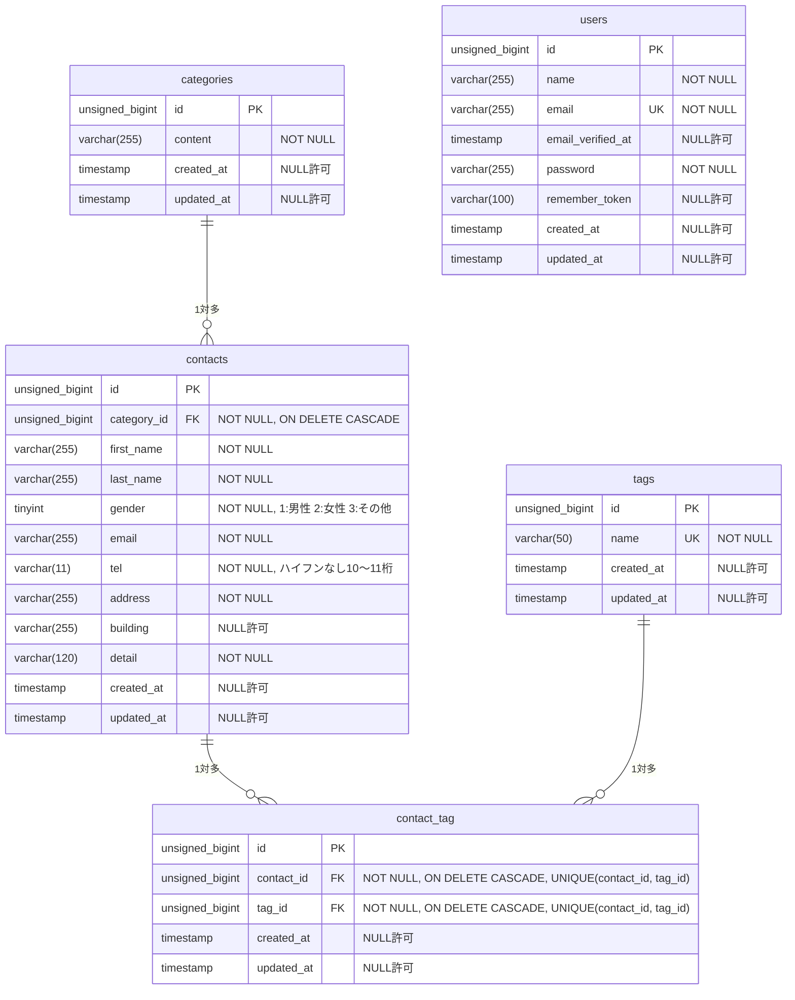

# COACHTECH お問い合わせフォーム

## 概要

一般ユーザーが利用する公開のお問い合わせフォームです。誰でもお問い合わせを送信でき、管理者はログイン後にその内容を確認・管理できます。

COACHTECH 基礎学習タームの確認テストとして、教材で学んだバックエンド技術（Laravel、DB 設計、テスト）を実践的にアウトプットすることを目的に作成しました。

## 実装機能

このアプリで利用者が行える操作の一覧です。

| 分類 | 機能 | 概要 |
|---|---|---|
| お問い合わせフォーム | お問い合わせ入力 | 名前、性別、メールアドレス、電話番号、住所、建物名、カテゴリ（お問い合わせの種類）、タグ、お問い合わせ内容を入力する |
| お問い合わせフォーム | お問い合わせ確認 | 入力した内容を確認し、送信するか修正するかを選ぶ |
| お問い合わせフォーム | お問い合わせ送信 | 確認した内容を保存し、サンクスページを表示する |
| 認証 | 管理者登録 | 名前、メールアドレス、パスワードで管理者を登録する |
| 認証 | ログイン | メールアドレスとパスワードで管理画面にログインする |
| 認証 | ログアウト | ログイン状態を解除する |
| 管理画面 | お問い合わせ一覧表示 | お問い合わせを新着順に7件ずつ表示する |
| 管理画面 | お問い合わせ検索 | 名前とメールアドレスの部分一致、性別、カテゴリ、日付で絞り込む |
| 管理画面 | お問い合わせ詳細表示 | 1件のお問い合わせを、カテゴリとタグを含めて表示する |
| 管理画面 | お問い合わせ削除 | 詳細ページから、そのお問い合わせを削除する |
| 管理画面 | タグ追加 | 新しいタグを追加する |
| 管理画面 | タグ編集 | タグの名前を変更する |
| 管理画面 | タグ削除 | タグを削除する |
| 管理画面 | CSV エクスポート | 検索条件に一致するお問い合わせを、BOM 付きの CSV でダウンロードする |
| 公開 API | お問い合わせ一覧取得 | お問い合わせの一覧を、検索とページネーション付きで取得する |
| 公開 API | お問い合わせ詳細取得 | 1件のお問い合わせを、カテゴリとタグを含めて取得する |
| 公開 API | お問い合わせ作成 | お問い合わせを作成し、タグを紐付ける |
| 公開 API | お問い合わせ更新 | お問い合わせを更新し、タグを入れ替える |
| 公開 API | お問い合わせ削除 | お問い合わせを削除する |

## 環境構築

### 前提

- Docker（Docker Desktop など）がインストールされ、起動していること

### 手順

Laravel Sail のコマンドは `./vendor/bin/sail` で記載しています。`sail` のエイリアスを設定している場合は、`sail` と読み替えてください。

1. リポジトリをクローンし、プロジェクトのディレクトリに移動する

   ```bash
   git clone https://github.com/m-murayama0327/contact-form-app.git
   cd contact-form-app
   ```

2. Composer の依存パッケージをインストールする

   ```bash
   docker run --rm \
       -u "$(id -u):$(id -g)" \
       -v "$(pwd):/var/www/html" \
       -w /var/www/html \
       -e COMPOSER_CACHE_DIR=/tmp/composer_cache \
       laravelsail/php82-composer:latest \
       composer install
   ```

3. `.env` ファイルを作成する

   ```bash
   cp .env.example .env
   ```

4. Laravel Sail を起動する

   ```bash
   ./vendor/bin/sail up -d
   ```

5. アプリケーションキーを生成する

   ```bash
   ./vendor/bin/sail artisan key:generate
   ```

6. テーブルを作成し、初期データを投入する

   ```bash
   ./vendor/bin/sail artisan migrate --seed
   ```

7. フロントエンドの依存パッケージをインストールし、Vite を起動する

   ```bash
   ./vendor/bin/sail npm install
   ./vendor/bin/sail npm run dev
   ```

   `./vendor/bin/sail npm run dev` は画面を確認するとき、テストを実行するときのどちらも起動したままにしておいてください。

## 動作確認

### 開発環境 URL

| 対象 | URL |
|---|---|
| お問い合わせフォーム | http://localhost |
| 管理画面 | http://localhost/admin |
| ログイン | http://localhost/login |
| 管理者登録 | http://localhost/register |
| 公開 API | http://localhost/api/v1/contacts |
| phpMyAdmin | http://localhost:8080 |

### ログイン用アカウント

初期データとして、次の管理者アカウントが登録されています。

| メールアドレス | パスワード |
|---|---|
| test@example.com | password |

### テスト実行

`./vendor/bin/sail npm run dev` を起動した状態で、別のターミナルから実行してください。

```bash
./vendor/bin/sail artisan test
```

## 使用技術

開発と動作確認に使用した技術とバージョンです。

| 分類 | 技術 | バージョン |
|---|---|---|
| 言語 | PHP | 8.5 |
| フレームワーク | Laravel | 10.x |
| 認証 | Laravel Fortify | 1.x |
| データベース | MySQL | 8.4 |
| フロントエンド | Vite | 5.x |
| フロントエンド | Tailwind CSS | 3.4 |
| フロントエンド | Alpine.js | 3.x |
| テスト | PHPUnit | 10.x |
| コード整形 | Laravel Pint | 1.x |
| 開発環境 | Docker | 29.x |
| 開発環境 | Laravel Sail | 1.x |
| 開発環境 | phpMyAdmin | 5.2 |

## ER図



contacts と tags は、中間テーブル contact_tag を介した多対多の関係です。users は、管理者のログインに使うテーブルで、ほかのテーブルとの関係はありません。

## API エンドポイント一覧

認証は不要です。バリデーションエラー（422）と、存在しない ID を指定したときのエラー（404）も JSON で返します。

| メソッド | パス | 概要 |
|---|---|---|
| GET | /api/v1/contacts | お問い合わせの一覧を、検索とページネーション付きで取得する |
| GET | /api/v1/contacts/{contact} | 1件のお問い合わせを、カテゴリとタグを含めて取得する |
| POST | /api/v1/contacts | お問い合わせを作成し、タグを紐付ける |
| PUT | /api/v1/contacts/{contact} | お問い合わせを更新し、タグを入れ替える |
| DELETE | /api/v1/contacts/{contact} | お問い合わせを削除する |

## 補足

### 要件シートとの相違点

次の6点は、要件シートの記載と異なる、または要件シートに記載がない点です。いずれも担当コーチに確認済みです。

- PHP と MySQL のバージョン：技術スタックでは PHP 8.2、MySQL 8.0 と指定されていますが、環境構築手順どおりに Laravel Sail を導入した結果、PHP 8.5、MySQL 8.4 になっています。
- Nginx：技術スタックには Nginx とありますが、環境構築手順どおりに構築した Laravel Sail の環境では Nginx が使われていないため、使用技術には記載していません。
- テーブル：テーブル仕様書にない password_reset_tokens、failed_jobs、personal_access_tokens の3つのテーブルが、Laravel に最初から用意されているマイグレーションファイルによって作成されます。今回のアプリでは使用していません。このほか、マイグレーションの実行履歴を記録する migrations テーブルが、Laravel によって自動で作成されます。
- 確認ページの「修正」ボタン：機能要件では「フォームhidden値でGET /へ戻る」とありますが、提供された Blade（confirm.blade.php）を書き換えずに使用しているため、ブラウザの「戻る」と同じ動き（history.back()）で入力ページに戻ります。
- CSV エクスポートの認証：機能要件に認証の記載はありませんが、ほかの管理機能と同じく、ログイン済みの管理者だけが利用できるようにしています。未ログインの場合は /login にリダイレクトされます。
- テストのメソッド名：開発プロセスの命名規則では「変数/メソッド: camelCase」とありますが、採点基準で使用する Laravel Pint がテストのメソッド名をスネークケースに整形するため、テストのメソッドだけスネークケース（`test_has_many_contacts` など）にしています。

### コマンド実行時の表示

次の2点は、コマンドを実行したときの表示についての補足です。いずれも不具合ではありません。

- テスト：`./vendor/bin/sail artisan test` を実行すると、DEPR（非推奨）と表示されることがあります。Laravel の設定ファイルで使用している定数が PHP 8.5 で非推奨になったためで、テストは正常に通っています。
- Laravel Pint：`./vendor/bin/sail bin pint --test` を実行すると、指摘がない場合は「PASS」と表示されます。導入された Laravel Pint のバージョンでは、「No fixable issues were found」ではなく「PASS」と表示されます。

## 作成者

村山 諒
